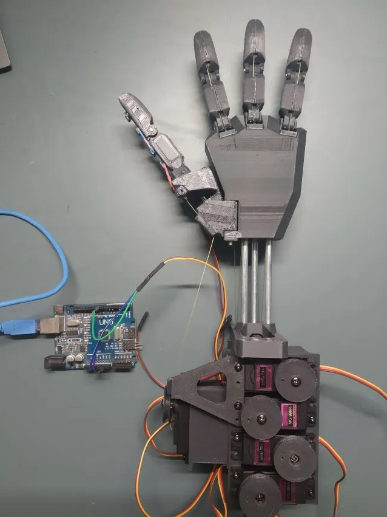
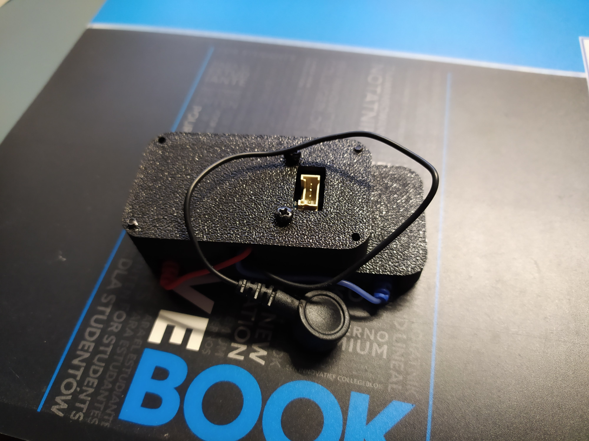
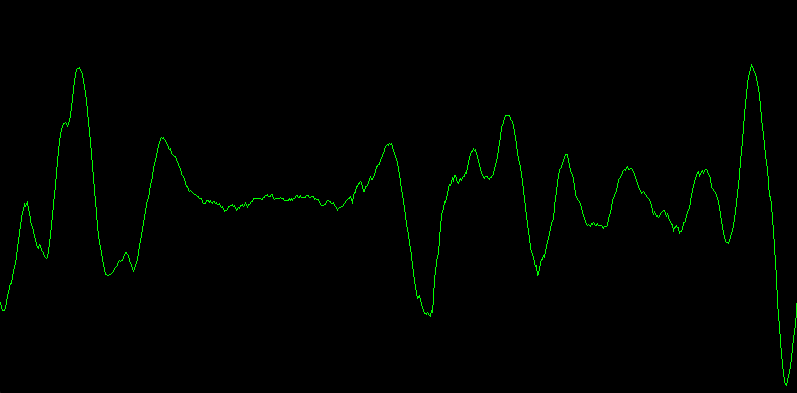
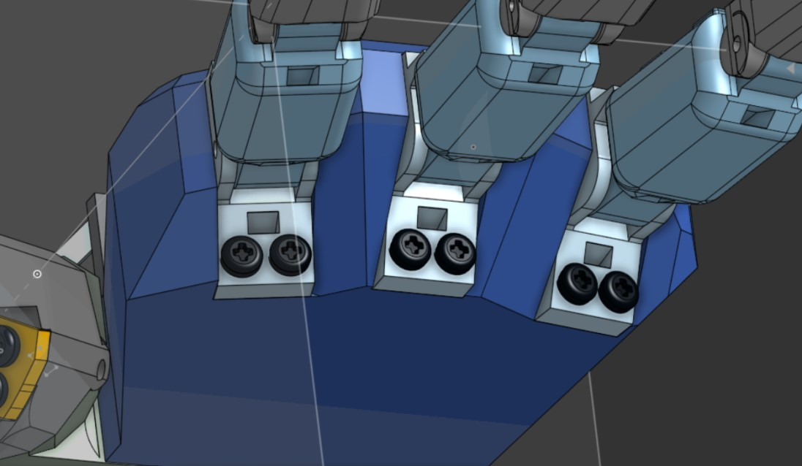
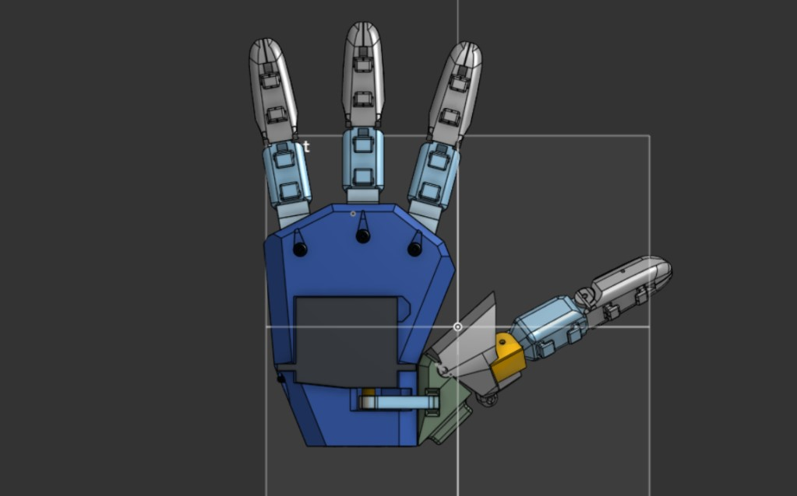
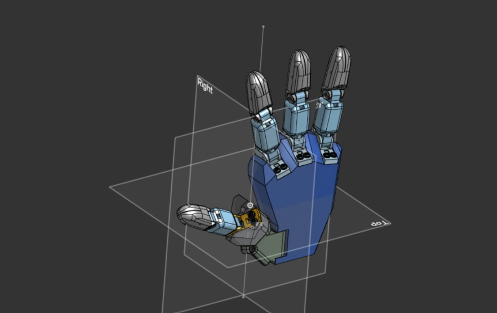

# Bionic-Hand-Controlled-By-EMG

# Bionic Hand Prosthesis - EMG Controlled Project

## Purpose

Presentation of the final version of the project for my portfolio. This project involves the design, construction, and software development of a custom bionic hand prosthesis controlled by Electromyography (EMG) signals. Developed as a collaborative effort by the "Silverhand" team, and **generously sponsored by Fundacja "Arbena"**, with support from our school, this project aims to create a functional, cost-effective, and intuitive prosthetic solution.

## Current Progress & Status

As of **June 2025**, the project has achieved significant milestones, despite encountering unprecedented challenges in EMG signal processing.

* **The entire prosthesis is fully assembled and mechanically functional.**
* **Initial control of the hand's movements using EMG signals has been established.**
* **Significant progress has been made in understanding and mitigating physical interference in EMG signal acquisition.**
* Currently, the team is focused on **advanced software development for robust EMG signal classification** to ensure precise and reliable control.

## Project Team & Mentorship

This project is a collaborative effort developed with a team of three colleagues, where I serve as the **Lead Engineer and Project Coordinator**. My role encompasses overseeing the design, hardware integration, software development, and managing the overall project execution.

The "Silverhand" team extends special thanks to **Fundacja "Arbena" for their invaluable sponsorship**, and to our project opiekun **Ms. Katarzyna Nierwińska**. We also express gratitude to **Ms. Marta Heblik** for organizing a crucial visit to the Faculty of Biomedical Engineering at the Silesian University of Technology in Sosnowiec. This visit provided the team with the opportunity to consult experts, notably **Dr. Eng. Michał Pielka**, whose ongoing support, advice, and direct consultations have been instrumental in improving our research methodology and overcoming technical hurdles.

**Follow our progress on Facebook:** https://www.facebook.com/profile.php?id=61567777667544

## Key Aspects & Technologies

This project combines mechanical engineering, electronics, and software development to create a sophisticated bionic device.

* **Mechanical Design & Actuation:**
    * The hand features **four fingers, each with two simplified joints**, plus a **thumb section with two additional degrees swobody** (for abduction/adduction and flexion).
    * Motion is achieved via a **tendon-driven system**, mimicking the natural mechanics of a hand. This approach required specific code corrections to maintain joint angles independently, as lower-degree tendon shortening affects higher-degree tendon length.
    * **Servo Motors:**
        * **MG90S 9g micro servos** are utilized for the upper finger joints.
        * **MG996R larger servos** are deployed for the lower finger sections and the thumb flexor section, providing the necessary strength for higher load points and the complex thumb movements.
    * **Single Screw Standard (M2.5):** The entire mechanical assembly relies on a single standard screw size – **M2.5 screws in various lengths**. This simplifies assembly, maintenance, and sourcing of components.
* **Electronics & Control Systems:**
    * **Microcontroller Architecture:**
        * An **Arduino Nano** acts as an intermediary, handling communication and data acquisition from the EMG sensors to the main control computer.
        * An **Arduino Uno** serves as the intermediary for controlling the servo motors based on commands from the computer.
    * **Power Supply:** The entire prosthesis can be powered efficiently from **a single, medium-sized LiPo battery**, ensuring portability and extended operational time.
* **3D Printing & Prototyping:**
    * All mechanical components of the prosthesis were custom-designed and 3D-printed using an **Ender-3** printer. This allowed for rapid prototyping, cost-effective iteration, and customization of the hand's geometry.
    * **CAD Software:** Onshape was used for meticulous design of all parts.

## EMG Signal Acquisition & Processing - A Core Challenge

The most significant and challenging aspect of this project has been the reliable acquisition and processing of Electromyography (EMG) signals. This task presented unique difficulties, as none of the team members had prior experience with EMG sensors or their specific operational characteristics.

* **EMG Sensor Operation:**
    * **GROOVE EMG modules** are used for muscle signal detection. The sensor is a simple device that measures general muscle activity along the line between measurement electrodes.
    * It employs a differential circuit that calculates the potential difference between electrodes based on a reference signal from a third electrode placed in an electromagnetically inactive area (e.g., elbow).
    * The resulting signal is then amplified approximately 10,000 times to obtain a useful signal readable by the microcontroller. The signal's magnitude is directly proportional to the activity of the muscle group it's attached to.

* **Initial Challenges & Iterations in Signal Processing:**
    * **Unexpected Complexity:** Simply connecting the sensor and reading values proved insufficient; precise methodology is required.
    * **Physical Interference:** Significant problems arose from physical interference introduced into the system (e.g., movement of long, loose electrode cables). These issues, including huge oscillations generated by the movement of loose, long electrode cables, were initially mistaken for muscle activity from hand movements.
    * **First Approach (Wavelet Transform):** An early attempt involved using wavelet transform to analyze signals and create spectrograms. This seemed promising due to easy-to-read spectrograms for identifying gesture-specific features (e.g., for a clenched fist). However, even with clean signals, this method yielded limited useful information, the reason for which was initially unclear to the team.
    * **Second Approach (Threshold/Noise Amplitude Detection):** The team then focused on simpler signal features. They observed that counting signal threshold crossings could indicate gestures (e.g., three crossings in two seconds for hand opening). Another observation was that "noise" amplitude (small, random oscillations) seemed to increase with muscle tension. The noise amplitude method, calculated by summing deviations from a 25-value moving average and then logarithmically scaling, initially showed promising results for muscle tension. However, this method was ultimately abandoned as the discovered cable interference contaminated all threshold crossings, rendering them useless for hand movement detection.

* **Current Approach & Planned Solutions (System Stiffening & Advanced Metrics):**
    * **Mitigating Interference:** Following expert advice from Dr. Eng. Michał Pielka, a **compact housing for the EMG sensor was designed and 3D-printed**. This innovation significantly stiffened and shortened the electrode cables (to just a few centimeters from initial tens of centimeters), drastically reducing signal noise from "mountains and valleys" to "small hills". This was a radical improvement.
    * **Advanced Filtering (Ongoing Research):** While the signal is much cleaner, the team is intensively researching suitable filters to further suppress noise, acknowledging the difficulty in achieving a perfectly stable and reliable sampling frequency (e.g., due to data transmission time to the computer). Even without perfect filtering, the signal is now clean enough for raw processing.
    * **Signal Metrics Extraction:** The next phase involves extracting specific metrics from the clean EMG signal within given time intervals to differentiate gestures.
        * **Planned Metrics:**
            1.  Signal crossings through the signal mean (or its best linear approximation).
            2.  Number of signal direction changes (positive or negative).
            3.  Signal energy.
            4.  Standard deviation of the signal.
            5.  Mean of the signal.
            6.  Wilson Amplitude (number of cases where the difference between neighboring values exceeds a set threshold).
        * The goal is to find a set of metrics that are well-clustered for a given gesture and maximally distinct from other gestures.
    * **Machine Learning for Classification (K Nearest Neighbours - KNN):** Each set of metrics will be treated as a vector or point in an N-dimensional space (where N is the number of metrics). The **K Nearest Neighbours (KNN) algorithm** is planned for classification due to its surprising simplicity in implementation and efficiency for non-large datasets. It does not require a separate training phase; it simply calculates Euclidean distances from the current point to all known labeled points and identifies the dominant gesture among the K nearest neighbors.
    * **Contingency Plan:** Should finding sufficiently discriminating metrics prove too difficult, a simpler approach focusing on basic hand clenching control via raw EMG signal strength will be considered, but only as a last resort to preserve the prosthesis's full potential. This would significantly limit the prosthesis's potential.

## Project Achievements & Recognition

* **"Best Research Project" Award:** The "Silverhand" project was presented at the Collegium ALO Conference in Poznań on April 10th and received the **"Najlepszego Projektu Badawczego Konferencji Collegium ALO" (Best Research Project of Collegium ALO Conference) award**. This event provided significant public exposure for the project.

## Visual Documentation

As a hardware-centric project, visual documentation is crucial to showcase the design, assembly, and functionality of the bionic hand.

### Onshape Model Screenshots

**Explore the Bionic Hand Onshape Project:** https://cad.onshape.com/documents/f7faa55ac548c9bef0bc9558/w/bd6b46742d823c7f0b30afed/e/84a34a6cfd8fc5eab1158611?renderMode=0&uiState=683f47223424a300c01d6417

**Explore the Motor Section Onshape Project:** https://cad.onshape.com/documents/82330b5e9f16e9f612e59c4f/w/ab81fad7eb12cae29176bfde/e/bc5c0132526e09a57f996cd3?renderMode=0&uiState=683f47df1ddc113c49900aeb

### Photographs of the Physical Prosthesis

**1. Full Hand Assembled**

*Figure 1: Picture of the assembled bionic hand prosthesis.*

**2. Motor Section Top**

*Figure 2: Motor section seen from the top.*

**3. Motor Section Bottom**

*Figure 3: Motor section seen from the bottom.*

**4. EMG Module Casing**

*Figure 4: EMG codule casing.*

### EMG Signal Comparison

**5. EMG Signal Before Cable Modifications**

*Figure 5: Raw EMG signal showing significant noise and interference before shortening and stiffening the electrode cables. This signal was taken during hand movement (up-down).*

**6. EMG Signal After Cable Modifications**

*Figure 6: Raw EMG signal showing drastically reduced noise after implementing the compact sensor housing and cable modifications. This signal was taken during hand movement (up-down).*

### Photographs of the CAD Models

**7. Zoom On The Hinges (CAD)**

*Figure 7: Photograph of the hinges responsible for bending fingers.*

**8. Hand From The Back (CAD)**

*Figure 8: Photograph of the back of the hand (servo responsible for flexing thumb visible).*

**9. Hand From The Profile (CAD)**

*Figure 9: Photograph of the profile of the hand.*

### More about the project

**Follow our progress on Facebook:** https://www.facebook.com/profile.php?id=61567777667544

## Skills Demonstrated

* **Project Management & Coordination**
* **Mechanical Design & Engineering (Robotics, Prosthetics)**
* **3D Printing & Custom Part Fabrication (Ender-3, Onshape)**
* **Electronics Design & Integration (Arduino, EMG sensors, Servos)**
* **Embedded Systems Programming (Arduino)**
* **Advanced Signal Processing & Machine Learning (EMG Classification, Wavelet Transform, KNN, Feature Extraction)**
* **Interdisciplinary Problem-Solving**
* **Team Leadership & Collaboration**
* **Prototyping & Iterative Development**
* **Technical Documentation & Presentation**
* **Mentorship & Expert Consultation Utilization**
